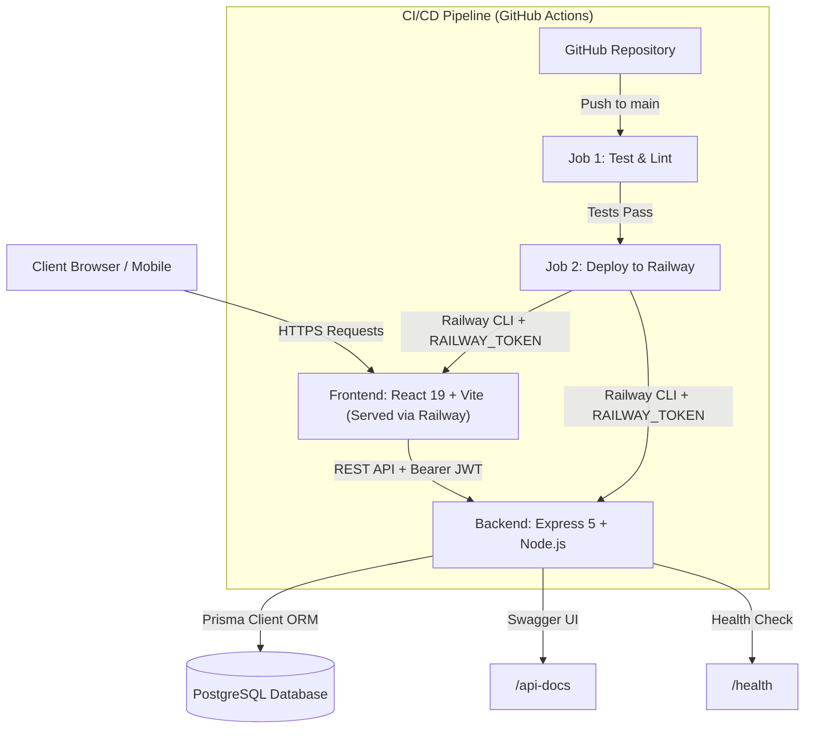

# ⚡ DevOps Full-Stack Platform

[](https://github.com)
[](https://nodejs.org)
[](https://react.dev)
[](https://www.postgresql.org)
[](https://www.prisma.io)
[](https://railway.app)
[](https://www.docker.com)
[](LICENSE)

A production-grade full-stack web application built for the **Full Stack Application Deployment & DevOps Assignment**. Features **User Registration with Unique Internal Platform ID Generation**, **Bcrypt Password Salting**, **Stateless JWT Authentication**, **PostgreSQL Database with Prisma ORM**, **Items Module CRUD Operations**, **Aesthetic Light / White Theme UI with Indigo Glass Accents**, **Interactive Swagger / OpenAPI Specs**, **Docker Containerization**, and **Automated GitHub Actions CI/CD to Railway**.

---

## 🌐 Live Production Links

| Service | Live Production URL |
| :--- | :--- |
| **Frontend Application** | [frontend-production-6714.up.railway.app](https://frontend-production-6714.up.railway.app) |
| **Backend REST API** | [backend-production-62255.up.railway.app](https://backend-production-62255.up.railway.app) |
| **Interactive Swagger Docs** | [backend-production-62255.up.railway.app/api-docs](https://backend-production-62255.up.railway.app/api-docs) |
| **GitHub Repository** | [github.com/sameershaik-07/Assignment](https://github.com/sameershaik-07/Assignment) |

---

## 📋 Table of Contents
1. [System Architecture & Workflow](#1-system-architecture--workflow)
2. [Key Features & Highlights](#2-key-features--highlights)
3. [Git Branching & Workflow Strategy](#3-git-branching--workflow-strategy)
4. [API Contracts & JSON Examples](#4-api-contracts--json-examples)
5. [Database Schema & Platform ID Design](#5-database-schema--platform-id-design)
6. [Production Database Migrations](#6-production-database-migrations)
7. [Step-by-Step Railway Deployment Guide](#7-step-by-step-railway-deployment-guide)
8. [GitHub Actions CI/CD Pipeline & Secrets](#8-github-actions-cicd-pipeline--secrets)
9. [Security & Production Hardening](#9-security--production-hardening)
10. [Troubleshooting & Diagnostic Matrix](#10-troubleshooting--diagnostic-matrix)
11. [Deployment Rollbacks & Log Auditing](#11-deployment-rollbacks--log-auditing)
12. [Local Setup Guide (NPM & Docker)](#12-local-setup-guide-npm--docker)
13. [Interactive Swagger OpenAPI Specs](#13-interactive-swagger-openapi-specs)

---

## 1. System Architecture & Workflow



---

## 2. Key Features & Highlights

- 🔑 **Unique Platform ID Generation**: Every registered user gets a custom internal identifier (`PLT-XXXXX`) generated upon account creation, separated from their email address.
- 🛡️ **Bcrypt Password Salting**: User passwords are encrypted with `bcrypt` (10 salt rounds) before storage. Plain-text passwords are never logged or stored.
- 🎟️ **Stateless JWT Authorization**: Secure session handling using JSON Web Tokens (JWT) sent via `Authorization: Bearer <token>` headers.
- 📦 **Items Module (CRUD)**: Authorized users can Create, Read, Filter, Update, and Delete items linked to their user account.
- ✨ **Glassmorphic UI**: Premium dark mode UI featuring glowing health status badges, 1-click Platform ID copy buttons, and responsive layouts.
- 🐳 **Full Docker & Docker Compose**: Instant local environment startup combining PostgreSQL, Backend, and Frontend containers with volume persistence.
- 📜 **Interactive Swagger UI**: Full OpenAPI 3.0 specification available live at `/api-docs`.

---

## 3. Git Branching & Workflow Strategy

The repository follows a strict 3-tier branching model:

```
feature/*  ───────►  dev  ───────►  main (Production)
 (Feature Dev)     (Integration)    (Triggers Railway Deploy)
```

- **`main` (Production Branch)**: Source of truth for production. Any merge into `main` automatically triggers the GitHub Actions deployment workflow.
- **`dev` (Integration Branch)**: Staging branch where feature branches are integrated and validated before merging to `main`.
- **`feature/*` (Feature Branches)**: Short-lived branches created for specific features or bug fixes (e.g. `feature/platform-id`, `feature/auth-jwt`).

---

## 4. API Contracts & JSON Examples

### 1. Health Check Endpoint
* **`GET /health`** (Public)
```json
{
  "status": "healthy",
  "timestamp": "2026-08-03T12:00:00.000Z",
  "uptime": 142.5,
  "database": "connected"
}
```

---

### 2. User Registration
* **`POST /api/auth/register`** (Public)
* **Request Body:**
```json
{
  "email": "devops.engineer@example.com",
  "password": "SecurePassword123!"
}
```
* **Response (201 Created):**
```json
{
  "message": "User registered successfully",
  "user": {
    "id": "c1f7a0b3-8d9e-4a12-b345-6789abcdef01",
    "email": "devops.engineer@example.com",
    "platformId": "PLT-cuid12345abcdef",
    "createdAt": "2026-08-03T12:05:10.123Z"
  }
}
```

---

### 3. User Login
* **`POST /api/auth/login`** (Public)
* **Request Body:**
```json
{
  "email": "devops.engineer@example.com",
  "password": "SecurePassword123!"
}
```
* **Response (200 OK):**
```json
{
  "message": "Login successful",
  "token": "eyJhbGciOiJIUzI1NiIsInR5cCI6IkpXVCJ9...",
  "user": {
    "id": "c1f7a0b3-8d9e-4a12-b345-6789abcdef01",
    "email": "devops.engineer@example.com",
    "platformId": "PLT-cuid12345abcdef"
  }
}
```

---

### 4. Items CRUD Module
* **`POST /api/items`** (Protected: `Authorization: Bearer <jwt>`)
* **Request Body:**
```json
{
  "title": "Production Deployment Plan",
  "description": "Railway deployment configuration with Prisma migrations"
}
```
* **Response (201 Created):**
```json
{
  "message": "Item created successfully",
  "item": {
    "id": "a9b8c7d6-e5f4-3210-9876-543210fedcba",
    "title": "Production Deployment Plan",
    "description": "Railway deployment configuration with Prisma migrations",
    "ownerId": "c1f7a0b3-8d9e-4a12-b345-6789abcdef01",
    "createdAt": "2026-08-03T12:10:00.000Z",
    "updatedAt": "2026-08-03T12:10:00.000Z"
  }
}
```

---

## 5. Database Schema & Platform ID Design

### Prisma Entity-Relationship (ER) Schema

```prisma
model User {
  id         String   @id @default(uuid())
  email      String   @unique
  password   String   // bcrypt hashed
  platformId String   @unique @default(cuid()) // Unique internal identifier (PLT-XXXXX)
  createdAt  DateTime @default(now())
  items      Item[]
}

model Item {
  id          String   @id @default(uuid())
  title       String
  description String?
  ownerId     String
  owner       User     @relation(fields: [ownerId], references: [id])
  createdAt   DateTime @default(now())
  updatedAt   DateTime @updatedAt
}
```

### Why Platform ID? (Architecture Design Rationale)
- **Decoupled Identity**: Emails can change or be updated. Using `platformId` (`PLT-XXXXX`) as the internal reference prevents database cascading breakages across microservices.
- **Privacy & Security**: Internal logging and public analytics refer to users by their `platformId` without exposing personal user email addresses.

---

## 6. Production Database Migrations

### The "Works Locally, Breaks in Prod" Trap & Solution
- **Local Dev**: Running `npx prisma migrate dev` creates interactive prompts and applies local schema changes.
- **Production (Railway)**: Running `migrate dev` in production is unsafe because it can prompt for input or reset live data.
- **Solution**: The production container startup command executes:
  ```bash
  npx prisma generate && npx prisma migrate deploy && node src/server.js
  ```
  *Running `npx prisma migrate deploy` automatically executes pending SQL migrations against the live Railway PostgreSQL instance **before** starting the Express web server.*

---

## 7. Step-by-Step Railway Deployment Guide

### Option A: Railway Dashboard Setup
1. Log into [Railway.app](https://railway.app) and create a new project.
2. Add a **PostgreSQL Database** service to the project.
3. Deploy two services from your GitHub repository:
   - **Backend Service**:
     - Service Root Directory: `backend`
     - Start Command: `npx prisma migrate deploy && node src/server.js`
     - Environment Variables:
       - `DATABASE_URL`: `${{Postgres.DATABASE_URL}}`
       - `JWT_SECRET`: `<your-random-high-entropy-secret>`
       - `PORT`: `5000`
   - **Frontend Service**:
     - Service Root Directory: `frontend`
     - Build Command: `npm run build`
     - Start Command: `npx serve -s dist -l $PORT`
     - Environment Variable:
       - `VITE_API_BASE_URL`: `https://<your-backend-railway-url>.up.railway.app`

### Option B: Railway CLI Commands
```bash
# Authenticate Railway CLI
railway login

# Link repository to project
railway link

# Deploy backend service
railway up --service backend

# Deploy frontend service
railway up --service frontend
```

---

## 8. GitHub Actions CI/CD Pipeline & Secrets

The repository contains `.github/workflows/deploy.yml` configured with a multi-job pipeline:

### Workflow Jobs Architecture
1. **`test-and-lint` (CI Job)**:
   - Runs on every Pull Request and push to `dev` / `main`.
   - Steps: Checkout → Setup Node 20 → Install dependencies → Run `npx prisma generate` → Execute Jest test suite (`npm test`).
2. **`deploy-to-railway` (CD Job)**:
   - Executes **only after `test-and-lint` passes** on the `main` branch.
   - Deploys latest changes to Railway using the official Railway CLI.

### Required GitHub Repository Secret
- **`RAILWAY_TOKEN`**: Generated in Railway (`Project Settings` -> `Tokens`) and stored under GitHub (`Settings` -> `Secrets and variables` -> `Actions`).

---

## 9. Security & Production Hardening

1. **Password Encryption**: All user passwords are encrypted using `bcrypt` with 10 salt rounds.
2. **CORS Restrictions**: Configured via `cors` middleware to explicitly allow trusted client origins.
3. **Stateless Authorization**: Protected endpoints require standard `Authorization: Bearer <jwt-token>` headers.
4. **SQL Injection Protection**: Prepared statements enforced via Prisma ORM parameterized queries.
5. **Input Validation**: All incoming API payloads are validated using **Zod** schemas (`validate.js`).

---

## 10. Troubleshooting & Diagnostic Matrix

| Issue / Error | Root Cause | Solution |
| :--- | :--- | :--- |
| **`Error: Cannot find module 'cors'`** | Missing `node_modules` in backend | Run `npm install` inside the `backend/` directory. |
| **`Cannot find module '.prisma/client/default'`** | Prisma client not generated for `@prisma/client` | Run `npx prisma generate` in `backend/`. |
| **`PrismaClientInitializationError: Driver adapter required`** | Prisma v7 requires PostgreSQL driver adapter | Verify `@prisma/adapter-pg` and `pg` are installed and initialized in `src/db.js`. |
| **`failed to bind host port 0.0.0.0:80/tcp`** | Host port 80 already occupied on machine | `docker-compose.yml` is updated to map frontend to port `8080:80`. |
| **`P1001: Can't reach database server`** | Invalid `DATABASE_URL` or network blocker | Check PostgreSQL service status or verify credentials in `.env`. |

---

## 11. Deployment Rollbacks & Log Auditing

### 1. Instant Railway UI Rollback
If a faulty deployment reaches production:
1. Open **Railway Dashboard** -> Select Service (`backend` or `frontend`).
2. Go to the **Deployments** tab.
3. Locate the last known good deployment card.
4. Click **Redeploy / Rollback**. Railway instantly routes HTTP traffic back to the previous healthy container.

### 2. Live Log Auditing
- View real-time HTTP requests, Prisma query logs, and exception stack traces directly in the **Railway Deployment Logs** tab or locally via `docker-compose logs -f`.

---

## 12. Local Setup Guide (NPM & Docker)

### Option A: Local Development (NPM)

1. **Clone repository**:
   ```bash
   git clone https://github.com/sameershaik-07/Assignment.git
   cd Assignment
   ```

2. **Configure Environment Variables**:
   ```bash
   cp .env.example backend/.env
   ```

3. **Install Dependencies**:
   ```bash
   cd backend && npm install && cd ..
   cd frontend && npm install && cd ..
   ```

4. **Run Database Migrations & Generate Prisma Client**:
   ```bash
   cd backend
   npx prisma migrate dev --name init
   npx prisma generate
   cd ..
   ```

5. **Start Applications**:
   ```bash
   # Terminal 1: Start Express Backend
   cd backend && npm run dev

   # Terminal 2: Start React Frontend
   cd frontend && npm run dev
   ```
   - **Backend API**: `http://localhost:5000`
   - **Frontend UI**: `http://localhost:5173`

---

### Option B: Local Development (Docker Compose)

Run the entire full-stack application (PostgreSQL + Backend + Frontend) in isolated containers:

```bash
docker-compose up --build
```

- **Frontend App**: `http://localhost:8080`
- **Backend API**: `http://localhost:5000`
- **Swagger Documentation**: `http://localhost:5000/api-docs`

---

## 13. Interactive Swagger OpenAPI Specs

Interactive OpenAPI 3.0 documentation is built directly into the backend using `swagger-jsdoc` and `swagger-ui-express`.

Access the live interactive Swagger UI in your browser at:
```
http://localhost:5000/api-docs
```

From Swagger UI, you can interactively test:
- User Registration & **Platform ID** generation
- User Login & JWT issuance
- `/health` server health check
- Complete Items CRUD operations (`GET`, `POST`, `PUT`, `DELETE`)
